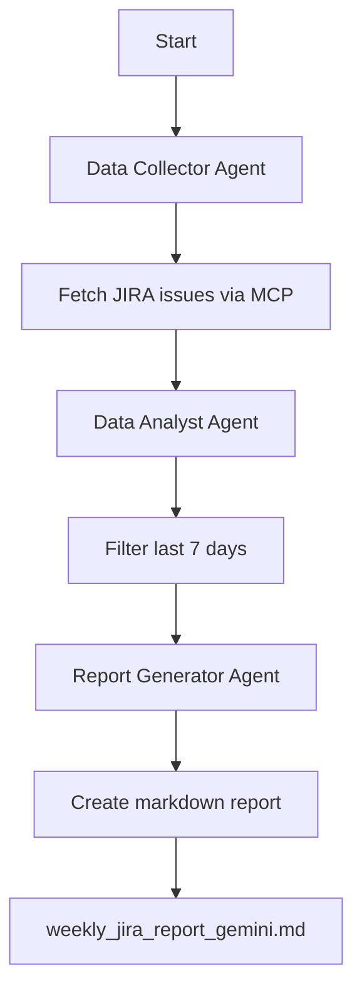

# 🚀 Gemini + CrewAI + MCP Server Setup Guide

This guide walks you through setting up the JIRA report agent using **Google Gemini** as the LLM with **CrewAI** framework and your existing **jira-mcp-snowflake** MCP server.

## 🎯 Architecture Overview

```
Gemini LLM ← CrewAI Agents ← MCP Tools → jira-mcp-snowflake Server → JIRA Data
```

## 📋 Prerequisites

1. **Google Gemini API Key** - Get from [Google AI Studio](https://makersuite.google.com/app/apikey)
2. **Your existing MCP server** - The `jira-mcp-snowflake` server we tested
3. **Python 3.9+** with pip

## ⚡ Quick Start

### 1. Install Dependencies

```bash
# Install the Gemini + CrewAI requirements
pip install -r requirements_crewai.txt
```

### 2. Environment Setup

Create a `.env` file or set environment variables:

```bash
# Copy the example and edit with your values
cp gemini_env_example.txt .env

# Edit .env with your actual API key:
# GEMINI_API_KEY=your-actual-gemini-api-key-here
# MCP_SERVER_URL=http://localhost:8000
```

Or export directly:

```bash
export GEMINI_API_KEY="your-gemini-api-key-here"
export MCP_SERVER_URL="http://localhost:8000"  # Your MCP server URL
```

### 3. Run the Gemini Agent

```bash
python crewai_gemini_implementation.py
```

## 🔧 Configuration Options

### Gemini Model Selection

Choose between different Gemini models based on your needs:

```bash
# Fast and cost-effective (default)
export GEMINI_MODEL="gemini-1.5-flash"

# More capable for complex analysis
export GEMINI_MODEL="gemini-1.5-pro"
```

### LLM Provider Switch

You can switch between Gemini and OpenAI:

```bash
# Use Gemini (default)
export LLM_PROVIDER="gemini"
export GEMINI_API_KEY="your-key"

# Use OpenAI instead
export LLM_PROVIDER="openai"
export OPENAI_API_KEY="your-key"
```

### MCP Server Configuration

```bash
# Local MCP server (default)
export MCP_SERVER_URL="http://localhost:8000"

# Remote MCP server
export MCP_SERVER_URL="https://your-mcp-server.com"

# Disable MCP and use direct JIRA API
export USE_MCP_SERVER="false"
export JIRA_BASE_URL="https://your-jira.com"
export JIRA_USERNAME="your-username"
export JIRA_API_TOKEN="your-token"
```

## 🎭 Agent Architecture

The Gemini implementation uses **3 specialized agents**:

### 1. 🔍 JIRA Data Specialist
- **Role**: Collects data from MCP server
- **Tools**: `MCPJIRADataTool`
- **Focus**: Efficient data extraction from projects

### 2. 📊 Data Analysis Expert  
- **Role**: Filters and validates data
- **Tools**: `DateFilterTool`
- **Focus**: Temporal analysis and data quality

### 3. 📝 Technical Report Specialist
- **Role**: Creates professional reports
- **Tools**: None (pure LLM reasoning)
- **Focus**: Clear stakeholder communication

## 🔄 Workflow Process



## ✅ Verification Steps

### 1. Test Environment

```bash
python crewai_config.py
```

Expected output:
```
✅ Environment configured for GEMINI + MCP integration
- LLM Provider: gemini
- Using MCP: true
- Projects: ['CCITJEN', 'CCITRP', 'QEHS']
- MCP URL: http://localhost:8000
- LLM created successfully: ChatGoogleGenerativeAI
```

### 2. Test MCP Connection

Verify your MCP server is accessible:

```bash
curl -X POST http://localhost:8000/mcp/jira-mcp-snowflake/list_jira_issues \
  -H "Content-Type: application/json" \
  -d '{"project": "CCITJEN", "status": "6", "limit": 5}'
```

### 3. Run Full Agent

```bash
python crewai_gemini_implementation.py
```

## 🚨 Troubleshooting

### Common Issues

#### 1. Gemini API Key Error
```
ValueError: GEMINI_API_KEY environment variable is required
```

**Solution**: 
- Get API key from [Google AI Studio](https://makersuite.google.com/app/apikey)
- Set environment variable: `export GEMINI_API_KEY="your-key"`

#### 2. MCP Server Connection Failed
```
Failed to connect to MCP server: Connection refused
```

**Solutions**:
- Check if MCP server is running: `curl http://localhost:8000/health`
- Verify URL in `MCP_SERVER_URL` environment variable
- Check firewall/network connectivity

#### 3. Rate Limiting
```
429 Too Many Requests
```

**Solutions**:
- Switch to `gemini-1.5-flash` for higher rate limits
- Add delays between requests
- Upgrade Gemini API quota

#### 4. Tool Import Errors
```
ModuleNotFoundError: No module named 'langchain_google_genai'
```

**Solution**:
```bash
pip install -r requirements_crewai.txt
```

## 📊 Performance Comparison

| Aspect | **Gemini 1.5 Flash** | **Gemini 1.5 Pro** |
|--------|----------------------|-------------------|
| **💰 Cost** | Lower | Higher |
| **⚡ Speed** | Faster | Slower |
| **🧠 Capability** | Good for reports | Better for analysis |
| **📊 Complex Reasoning** | Basic | Advanced |
| **📝 Report Quality** | High | Very High |

## 🎯 Best Practices

### 1. **Model Selection**
- Use `gemini-1.5-flash` for regular reporting (default)
- Use `gemini-1.5-pro` for complex analysis or when quality is critical

### 2. **Error Handling** 
- The implementation includes robust error handling for MCP failures
- Automatic fallback to error messages in reports
- Graceful handling of date parsing issues

### 3. **Performance Optimization**
- Set `temperature=0.1` for consistent reports
- Enable `memory=True` for context retention
- Use `planning=True` for better task coordination

### 4. **Cost Management**
- Monitor API usage in Google Cloud Console
- Set usage alerts for cost control
- Use flash model for development/testing

## 🔄 Migration from Original Implementation

If migrating from the Llama Stack version:

### 1. Keep Same Data Source
```bash
# Your MCP server continues to work
export USE_MCP_SERVER="true"
export MCP_SERVER_URL="http://localhost:8000"
```

### 2. Switch LLM Provider
```bash
# From: Llama Stack + OpenAI
# To: CrewAI + Gemini
export LLM_PROVIDER="gemini"
export GEMINI_API_KEY="your-key"
```

### 3. Enhanced Capabilities
- ✅ Same JIRA data access via MCP
- ✅ Better multi-agent collaboration  
- ✅ More sophisticated reporting
- ✅ Better error handling
- ✅ Standalone deployment (no Llama Stack needed)

## 🎁 Example Output

The agent generates a professional report like:

```markdown
# Weekly JIRA Closed Issues Report
**Report Period:** July 15-22, 2025

## Executive Summary
- Total issues closed: 12
- CCITJEN: 5 issues
- CCITRP: 4 issues  
- QEHS: 3 issues

## Detailed Results
[Professional tables with issue details]
```

## 🆘 Support

If you encounter issues:

1. **Check environment**: `python crewai_config.py`
2. **Verify MCP server**: Test endpoint directly
3. **Check logs**: Run with verbose mode
4. **Review API limits**: Check Gemini quotas

## 🚀 Next Steps

1. **Run basic test**: `python crewai_gemini_implementation.py`
2. **Customize prompts**: Edit agent backstories and tasks
3. **Add more projects**: Extend the projects list
4. **Schedule reports**: Set up cron jobs for automation
5. **Add integrations**: Connect to Slack, email, etc.

---

**🎉 You're ready to use Gemini with CrewAI and your MCP server!** 

The setup provides the same JIRA data access with enhanced AI capabilities and better architectural design. 